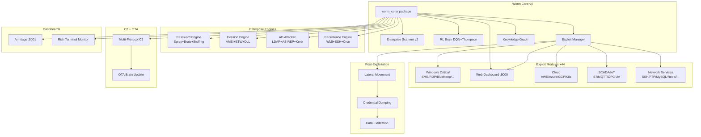
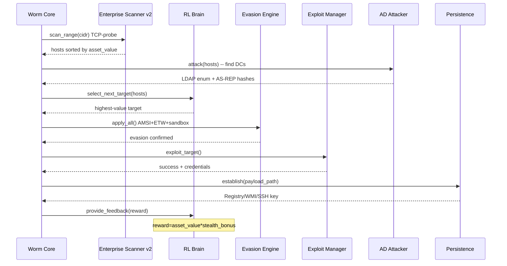
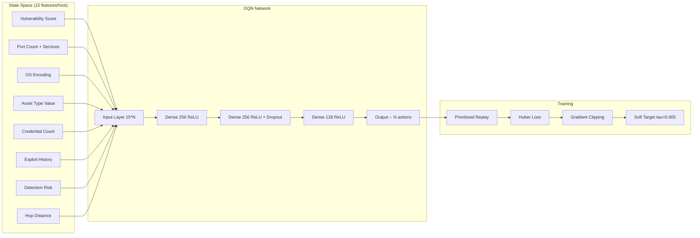

<p align="center">
  <h1 align="center">Wormy -- ML Network Worm v4.0</h1>
  <p align="center">
    <strong>ML-Driven Autonomous Network Propagation Platform</strong>
  </p>
  <p align="center">
    <a href="https://github.com/Ruby570bocadito/Wormy-ML-Network-Worm"></a>
    <a href="https://github.com/Ruby570bocadito/Wormy-ML-Network-Worm"></a>
    <a href="https://github.com/Ruby570bocadito/Wormy-ML-Network-Worm"></a>
    <a href="https://github.com/Ruby570bocadito/Wormy-ML-Network-Worm"></a>
    <a href="https://github.com/Ruby570bocadito/Wormy-ML-Network-Worm"></a>
    <a href="https://github.com/Ruby570bocadito/Wormy-ML-Network-Worm"></a>
    <a href="https://github.com/Ruby570bocadito/Wormy-ML-Network-Worm"></a>
  </p>
  <p align="center">
    <strong>Developed by <a href="https://github.com/Ruby570bocadito">Ruby570bocadito</a></strong>
  </p>
</p>

---

> **EDUCATIONAL & AUDIT PURPOSE ONLY** -- Only use on systems you own or have explicit written authorization for. Unauthorized access is illegal.

---

## Table of Contents

- [Overview](#overview)
- [Architecture](#architecture)
- [Quick Start](#quick-start)
- [Usage & Commands](#usage--commands)
- [Exploit Modules (44)](#exploit-modules-44)
- [The ML Brain](#the-ml-brain)
- [Enterprise Evasion Engine](#enterprise-evasion-engine)
- [Enterprise Password Engine](#enterprise-password-engine)
- [Active Directory Module](#active-directory-module)
- [Multi-Protocol C2](#multi-protocol-c2)
- [Web Dashboards](#web-dashboards)
- [Interactive CLI](#interactive-cli)
- [Project Structure](#project-structure)
- [Requirements](#requirements)
- [License](#license)

---

## Overview

Wormy is an **ML-driven network propagation framework** for authorized red team operations. It combines reinforcement learning-based decision making with enterprise-grade exploitation techniques to simulate advanced persistent threats (APTs) in controlled environments.

### What makes it different

- **RL Brain** -- DQN + Thompson Sampling that learns which targets to prioritize based on asset value (DC=100, DB=70, Workstation=10)
- **44 real exploit modules** -- Windows critical, webapp, cloud, SCADA, IoT, and classic network services
- **Real AMSI/ETW/DLL-unhook evasion** -- actual memory patching, not stubs
- **Active Directory attack chain** -- LDAP enum to AS-REP Roast to Kerberoast (no credentials needed)
- **Multi-protocol C2** -- HTTPS, DNS-over-HTTPS, ICMP tunneling, P2P gossip mesh
- **OTA Brain Updates** -- receive new model weights via C2 and hot-swap without restart
- **Adaptive exploit selection** -- contextual bandit with Thompson Sampling chooses the best exploit per target

---

## Architecture

### System Overview



### Propagation Flow



---

## Quick Start

```bash
# 1. Clone
git clone https://github.com/Ruby570bocadito/Wormy-ML-Network-Worm
cd Wormy-ML-Network-Worm

# 2. Install all dependencies
pip install -r requirements.txt

# 3. Dry-run (safe simulation, no real exploits)
python3 -m worm_core --dry-run

# 4. Against Docker lab
docker compose -f docker-compose-lab.yml up -d
python3 tests/run_worm_vs_lab.py

# 5. Full scan + exploit mode (authorized environment only)
sudo ./scripts/deploy_kali.sh --live --target 192.168.1.0/24
```

---

## Usage & Commands

```bash
# Interactive mode with full CLI (recommended)
python3 -m worm_core --dry-run --interactive

# Profiles
python3 -m worm_core --profile stealth       # Slow, full evasion
python3 -m worm_core --profile aggressive    # Fast, maximum spread
python3 -m worm_core --profile audit         # Medium, logging

# Scan only
python3 -m worm_core --scan-only

# With Metasploit
python3 -m worm_core --config configs/config_msf.yaml

# One-command automation (Kali)
sudo ./scripts/deploy_kali.sh --live --target 10.0.1.0/24
```

### Arguments

| Argument | Description |
|---|---|
| `--config <file>` | Configuration file |
| `--scan-only` | Scan network and exit |
| `--kill-switch <code>` | Activate kill switch |
| `--profile <name>` | stealth, aggressive, audit |
| `--dry-run` | Simulate without real exploits |
| `--no-monitor` | Disable CLI monitor |
| `--interactive` | Interactive CLI mode |

---

## Exploit Modules (44)

All modules inherit from `BaseExploit` and plug into the `ExploitManager` which uses a contextual bandit to select the best exploit per target.

### Windows Critical (7)

| Module | Target | Technique |
|---|---|---|
| SMB / EternalBlue | MS17-010 | SMBv1 buffer overflow |
| RDP / BlueKeep | CVE-2019-0708 | RDP pre-auth RCE |
| Zerologon | CVE-2020-1472 | Netlogon privilege escalation |
| PrintNightmare | CVE-2021-34527 | Spooler RCE/LPE |
| Exchange ProxyShell | CVE-2021-34473 | Pre-auth RCE chain |
| Docker daemon | 2375/tcp | Unauthenticated API abuse |
| Kubernetes | 6443/tcp | Kubelet API / dashboard RCE |

### Web Application (12)

| Module | Target | Technique |
|---|---|---|
| Log4j | CVE-2021-44228 | JNDI injection via headers/params |
| Struts | CVE-2017-5638 | OGNL injection, ProcessBuilder RCE |
| WebLogic | CVE-2020-14882/14883 | Console RCE via ShellSession |
| Jenkins | Script Console | Groovy script RCE |
| Jira | Velocity | SSTI via template injection |
| Confluence | OGNL | ProcessBuilder payload |
| Citrix | CVE-2019-19781 | Path traversal + webshell deploy |
| GitLab | DjVu/ExifTool | Payload via file upload |
| WordPress | Various | Plugin/admin RCE |
| Apache | Path traversal | LFI/RFI + RCE chain |
| Tomcat | AJP/manager | Ghostcat + manager deploy |
| Elasticsearch | 9200/tcp | Painless script RCE |

### Cloud & Infrastructure (6)

| Module | Target | Technique |
|---|---|---|
| AWS CloudFormation | Stack creation | IAM escalation via templates |
| Terraform | State files | Backend state manipulation |
| GCP IAM | Service accounts | Privilege escalation |
| Kubernetes | K8s API | Pod exec + service account abuse |
| Docker | Docker API | Container escape |
| VMware vCenter | VCSA | CVE-based RCE |

### SCADA & IoT (3)

| Module | Target | Technique |
|---|---|---|
| Siemens S7 | S7comm | PLC read/write, stop CPU |
| MQTT | 1883/tcp | Subscribe to topics, inject messages |
| OPC UA | 4840/tcp | Read/write tags, server manipulation |

### Network Services (16)

| Module | Technique |
|---|---|
| SSH | Brute force + key-based auth |
| FTP | Anonymous + brute force |
| Telnet | Default creds + brute force |
| SMB | Pass-the-Hash, enum shares |
| MySQL | Default creds + query RCE |
| MSSQL | xp_cmdshell RCE |
| PostgreSQL | cmd exec via extensions |
| MongoDB | NoAuth access + RCE |
| Redis | CONFIG SET RCE + SLAVEOF exfil |
| Active Directory | LDAP enum + Kerberoast + AS-REP |
| SNMP | Community string brute force |
| VNC | NoAuth + brute force |
| Elasticsearch | Painless script RCE |
| Docker | API abuse + container escape |
| Kubernetes | Pod exec + service account |
| VPN (IKE/IPSEC) | Aggressive mode PSK cracking |

---

## The ML Brain

### Adaptive Exploit Selection with Thompson Sampling

The exploit selector uses a **contextual bandit** with Thompson Sampling to rank and select exploits for each target. Each exploit is scored based on past success/failure history, and the system automatically balances exploitation (using known-good exploits) with exploration (trying less-used ones).



### Asset Value Reward Function

```python
ASSET_VALUES = {
    'domain_controller': 100,
    'container_host':     90,
    'exchange_server':    80,
    'database_server':    70,
    'file_server':        60,
    'web_server':         30,
    'workstation':        10,
}

TECHNIQUE_MULTIPLIERS = {
    'kerberoasting':   1.5,
    'pass_the_ticket': 1.3,
    'ssh_pivot':       1.1,
    'exploit_rce':     0.9,
    'brute_force':     0.8,
}
```

### RL Engine

- Double DQN with prioritized replay memory
- Gradient clipping + soft target updates (tau=0.005)
- Automatic model save/load with fallback to training
- OTA model updates via C2 without restart

---

## Enterprise Evasion Engine

### AMSI Bypass
Patches `AmsiScanBuffer` in memory to return `AMSI_RESULT_CLEAN` for all scans.

### ETW Silencing
Patches `EtwEventWrite` to prevent ETW telemetry from reaching the kernel.

### DLL Unhooking
Restores clean copies of ntdll.dll from disk to remove EDR user-land hooks.

### Additional Techniques
- **Sandbox detection** -- VM artifacts, process list, RAM thresholds, username analysis
- **Sleep jitter** -- Log-normal distribution sleep timing to evade beacon detection
- **JA3 fingerprint spoofing** -- Mimics Chrome 120 TLS signatures
- **Memory execution** -- Position-independent shellcode execution
- **Polymorphic engine** -- AST-level metamorphism, semantic NOP injection, hash verification
- **Direct NT syscalls** -- Dynamic SSN resolution to bypass user-land hooks
- **Sleep obfuscation** -- Heap encryption + stack spoofing during sleep intervals

---

## Enterprise Password Engine

### Features

- Password spray with lockout protection (1 password x N targets per window)
- Mutation engine: 35+ variants per base word (Admin, 4dm1n!, Admin@2024, ...)
- Company-based password generation
- Credential stuffing from breach lists
- Parallel execution with configurable thread pool
- Protocol handlers: SSH, FTP, MySQL, Postgres, MSSQL, MongoDB, HTTP

### Mutation Examples

```
Input: 'Admin'
  Admin, admin, ADMIN, Admin!
  Admin1, Admin123, Admin2024
  Admin@2024, Admin@123
  4dm1n, 4dm1n!, 4dm1n123
  !Admin!, Admin#1, Admin@1
  AdminWinter2024, AdminSummer2024
  ...

Spray mode (lockout-safe):
  Round 1: 'Welcome1'    x 50 targets (parallel)
  [wait 300s anti-lockout window]
  Round 2: 'Password123' x 50 targets (parallel)
```

---

## Active Directory Module

- **DC discovery** via port signature (88+389) and DNS SRV records
- **LDAP enumeration** (null session or authenticated)
- **AS-REP Roasting** -- crackable hashes without credentials (`hashcat -m 18200`)
- **Kerberoasting** -- TGS ticket extraction (`hashcat -m 13100`)
- BloodHound JSON export utility for attack path visualization

---

## Multi-Protocol C2

- **HTTPS/HTTP beaconing** with configurable jitter
- **DNS-over-HTTPS (DoH)** covert channel via Cloudflare/Google TXT records
- **Domain Fronting** -- CDN Host header override
- **P2P Gossip mesh** -- agents share intel without central C2
- **Encrypted SQLite command queue** -- commands survive C2 downtime
- **Exponential backoff** (1s to 300s) with jitter
- **OTA Brain Update** -- send .pth model weights, hot-swap without restart
- **ICMP tunneling** -- bi-directional C2 over raw ICMP Echo packets
- **Cloud relay** -- Telegram Bot API, Slack Webhooks, Google Sheets
- **Perfect Forward Secrecy** -- X25519 ECDH + AES-256-GCM

---

## Web Dashboards

### Armitage Dashboard -- http://localhost:5001

Visual network map inspired by Metasploit's Armitage GUI:
- **Network Map**: Host icons with color-coded status
- **Statistics**: Real-time counts of infected, discovered, failed hosts
- **Activity Feed**: Live event log with timestamps
- **Context Menu**: Right-click on hosts to Exploit, Scan, view Vulnerabilities

### Web Dashboard -- http://localhost:5000

Professional monitoring dashboard:
- **8 Stat Cards**: Infected, Discovered, Vulnerabilities, Exploit Chains, Lateral Movement, Credentials, C2 Beacons, Polymorphic Mutations
- **Hosts Table**: IP, OS, Status, Health, Payload variant
- **8 REST API Endpoints**: `/api/status`, `/api/hosts`, `/api/activity`, `/api/vulnerabilities`, `/api/credentials`, `/api/topology`, `/api/stats`, `/api/command`

---

## Interactive CLI

Start with `python3 -m worm_core --dry-run --interactive`

| Command | Description |
|---|---|
| `scan [professional\|basic]` | Scan network with visual progress bar |
| `targets` | List all discovered hosts |
| `vulns <ip>` | Show vulnerabilities for a target |
| `topo` | Generate network topology visualization |
| `exploit <ip>` | Exploit a specific target |
| `chain <ip>` | Show exploit chain for a target |
| `bruteforce <ip> [service]` | Brute force credentials |
| `deploy <ip> [type]` | Deploy payload |
| `exec <ip> <command>` | Execute command on infected host |
| `persist <ip> [methods]` | Establish persistence |
| `pivot <source_ip>` | Show lateral movement options |
| `status` | Current propagation status |
| `hosts` | Host monitoring dashboard |
| `run [iterations]` | Start propagation for N iterations |
| `stop` | Stop propagation |
| `report` | Generate full audit report |

---

## Project Structure

```
wormy/
├── worm_core/                        # Main orchestrator package
│   ├── __init__.py                   # Re-exports WormCore from mixins
│   ├── __main__.py                   # Entry point (python3 -m worm_core)
│   ├── config_profiles.py            # Stealth/aggressive/audit profiles
│   ├── module_imports.py             # Lazy imports for 44 modules
│   ├── mixin_base.py                 # Init, safety, shutdown (700 lines)
│   ├── mixin_scanning.py             # CIDR discovery, host classification
│   ├── mixin_exploitation.py         # Exploit target, brute force, service login
│   ├── mixin_lateral.py              # Pivot, spread, pass-the-hash
│   ├── mixin_propagation.py          # Adaptive cycles, online learning
│   ├── mixin_reporting.py            # Audit trail, session logging
│   └── standalone.py                 # get_local_ip(), main()
├── configs/                          # YAML configuration files
│   └── config_msf.yaml               # Metasploit RPC integration
├── scanner/                          # Enterprise + Professional scanners
├── exploits/                         # Exploit manager + 44 exploit modules
│   ├── exploit_manager.py            # Contextual bandit selector
│   ├── modules/                      # All 44 exploit implementations
│   ├── enterprise_password_engine.py # Spray + mutation + stuffing
│   └── active_directory.py           # LDAP enum + Kerberoast
├── evasion/                          # AMSI/ETW/DLL, polymorphic, IDS
├── post_exploit/                     # Lateral movement, persistence
├── c2/                               # Multi-protocol C2 + OTA updates
│   ├── multi_protocol_c2.py          # HTTPS/DoH/ICMP/P2P
│   ├── pfs_crypto.py                 # X25519 + AES-256-GCM
│   └── resilient_c2.py               # DoH + Domain Fronting + SQLite queue
├── rl_engine/                        # DQN + Thompson Sampling agent
├── core/                             # Wave propagation, agent controller
├── monitoring/                       # Web + Armitage dashboards
├── swarm/                            # Multi-agent swarm coordinator
├── payloads/                         # Payload generation and management
├── ml_models/                        # Trained ML models
├── training/                         # RL training pipeline + scenarios
├── tests/                            # 35 passing / 4 known failures
├── scripts/                          # deploy_kali.sh, cleanup_engagement.py
├── utils/                            # Audit, BloodHound, MITRE, crypto
├── docs/API.md                       # REST API reference
├── docker-compose-lab.yml            # Vulnerable lab environment
└── requirements.txt
```

---

## Requirements

```bash
pip install -r requirements.txt
```

### Core
- torch>=2.0.0, impacket>=0.11.0, paramiko>=3.4.0, requests>=2.31.0
- rich>=13.0.0, psutil>=5.9.0, pyyaml>=6.0.1, networkx>=3.0

### Enterprise
- pymysql, pymongo, psycopg2-binary, ldap3, dnspython

### Optional
- scapy, python-nmap, gymnasium, websocket-client

---

## License

MIT License -- for authorized security research and penetration testing only.

**2024 Ruby570bocadito** -- [GitHub](https://github.com/Ruby570bocadito/Wormy-ML-Network-Worm)
