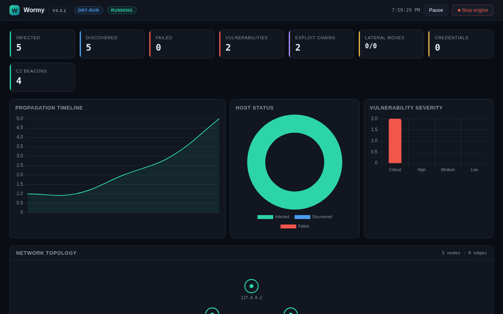
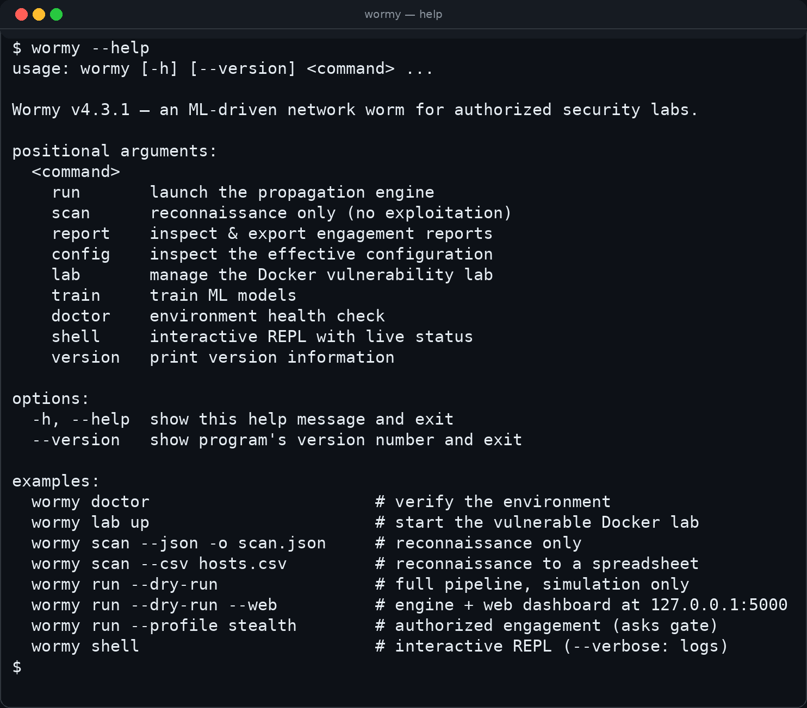
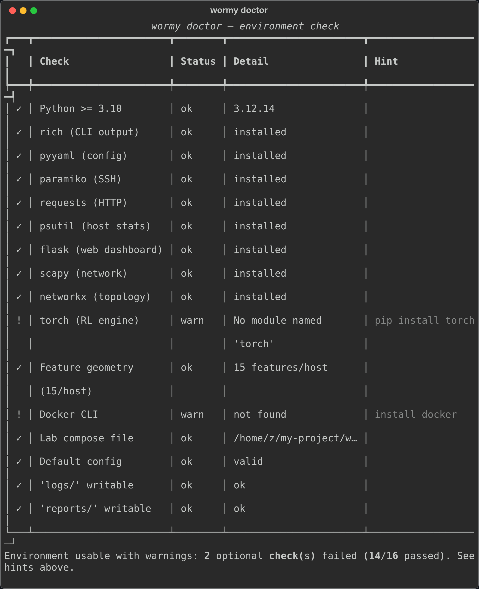
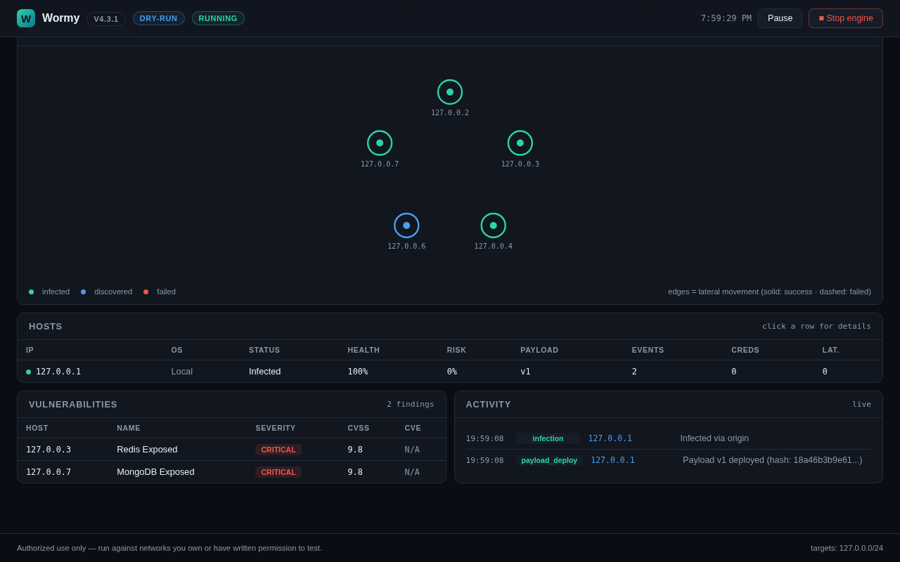

<div align="center">

# Wormy

**An ML-driven network propagation framework for authorized security labs**

Deep reinforcement learning decides *where* to spread and *which* exploit to use —
wrapped in a safety-first engineering discipline: dry-run mode, geofencing, an
authorization gate, hard infection caps and a kill switch.

[](https://github.com/Ruby570bocadito/Wormy-ML-Network-Worm/actions/workflows/ci.yml)
[](https://www.python.org/)
[](#testing--ci)
[](LICENSE)

`wormy doctor` · `wormy lab up` · `wormy run --dry-run` · `wormy shell`



*Operations dashboard in demo mode — KPIs, propagation timeline, vulnerability severity and live network topology.*

</div>

---

## ⚠️ Authorized use only

Wormy actively exploits vulnerabilities. It is an **educational red-team framework**
built for TFG-level research, labs and controlled engagements.

- Run it **only** against networks you own or have **written authorization** to test.
- Live mode is gated: `wormy run` refuses to exploit unless you pass
  `--yes-i-am-authorized` (or set `WORMY_AUTHORIZED=1`).
- `--dry-run` gives you the full pipeline with zero real exploits —
  simulation only, safe to demo anywhere.
- The authors take no responsibility for misuse. See [docs/SAFETY.md](docs/SAFETY.md).

## What is Wormy?

Wormy models a self-propagating network worm in which a **Deep Q-Network** learns
the propagation policy: which host to attack next and which exploit to use, based
on 15 features per host (open ports, OS guess, asset value, credential count,
detection risk…). The engine is deliberately transparent — every decision, every
exploit attempt and every safety check is logged and reported, which makes it a
good teaching artifact for both **offensive security** and **applied RL**.

Everything runs against a disposable **Docker lab** of deliberately vulnerable
services (SSH, Tomcat, Log4Shell, Struts, Redis, Postgres…), so the whole
pipeline can be demonstrated end-to-end without touching a real network.

## Quick start

> Requirements: Python 3.10+, Docker (for the lab), and `pip install -r requirements.txt`.

```bash
git clone https://github.com/Ruby570bocadito/Wormy-ML-Network-Worm.git
cd Wormy-ML-Network-Worm
pip install -r requirements.txt          # or: pip install .

# 0) Sanity-check the environment (deps, config, docker, feature geometry)
wormy doctor

# 1) Start the vulnerable lab (15 services, bound to 127.0.0.1)
wormy lab up

# 2) Reconnaissance only — no exploitation, JSON-exportable
wormy scan --target 127.0.0.0/24 --output scan.json

# 3) Full pipeline in simulation mode — safe by design
wormy run --dry-run --target 127.0.0.0/24

# 4) Watch it think in the interactive REPL
wormy shell --dry-run

# or the 10-second version, no lab needed:
make demo
```

Live mode (authorized engagements only):

```bash
wormy run --profile stealth --yes-i-am-authorized
```

## The CLI

`wormy` is a subcommand-driven CLI (rich-formatted help, machine-readable
`--json` output, predictable exit codes: `0` ok · `1` error · `2` usage · `130`
interrupted).



The built-in `doctor` verifies the environment before you do anything else —
critical problems are red, optional capabilities (torch, Docker) are yellow
warnings with a fix hint:



| Command | What it does |
|---|---|
| `wormy run` | Full propagation pipeline. Flags: `--dry-run`, `--scan-only`, `--profile {stealth,aggressive,audit,lab_docker}`, `--target CIDR…`, `--web`, `--interactive`, `--kill-switch CODE`, `--yes-i-am-authorized` |
| `wormy scan` | Reconnaissance only. `--basic`, `--json`, `--output FILE` |
| `wormy lab` | Docker lab manager: `up`, `down`, `status`, `rebuild`, `urls` (`--expanded` for the 15-service compose) |
| `wormy train` | Train ML models: `rl` (curriculum), `classifier`, `evasion`, `all`; `--list-scenarios`, `--status` |
| `wormy doctor` | Environment health check: deps, torch/CUDA, docker, config validity, feature geometry, writable dirs |
| `wormy shell` | Interactive REPL: `scan`, `targets`, `exploit <ip>`, `creds`, `run`, `stop`, `report`, … |
| `wormy version` | Version + platform info (`--json` for scripts) |

REPL session against the lab:

```
○ IDLE  wormy::0 infected::0 hosts
> scan
              6 hosts discovered
 IP          OS        Ports       Vulns  Chains  Status
 10.0.0.5    Linux     22, 8080    3      2       DISCOVERED
 10.0.0.6    Windows   445, 3389   5      3       DISCOVERED
> exploit 10.0.0.5
 Exploit succeeded
> creds
 2 credentials
 Username   Password
 root       labpass123
> run
━ Iteration 1 ━
```

## Web dashboard

Start the engine with `wormy run --web` (or `wormy run --dry-run --web`) and open
**http://127.0.0.1:5000**. You can also try the UI **without any engine** using
synthetic demo data:

```bash
python -m monitoring.web_dashboard --demo   # clearly-labelled demo engagement
```

- Live KPIs, propagation timeline, severity distribution (Chart.js, degrades
  gracefully offline)
- **Network topology** rendered as an SVG graph — nodes colored by status,
  edges for lateral movement (solid = success, dashed = failed)
- Host detail dialog, vulnerabilities table and a live activity feed (all
  rendered XSS-safe)
- **Emergency stop** button — cooperative stop, same code path as the CLI
- Binds to `127.0.0.1` by default; command execution over HTTP is **disabled**
  unless `WORMY_DASHBOARD_COMMANDS=1`



*Host inventory, vulnerability findings and the live activity feed.*

REST API reference: [docs/API.md](docs/API.md).

## Architecture

```
                       ┌──────────────────────────────────┐
                       │            wormy CLI             │
                       │  run / scan / lab / train / shell│
                       └───────────────┬──────────────────┘
                                       │
                                       ▼
┌──────────────────────────── WormCore (mixins) ─────────────────────────────┐
│  scanning ──▶ propagation ──▶ exploitation ──▶ lateral ──▶ reporting       │
│      │              │              │               │            │          │
│      ▼              ▼              ▼               ▼            ▼          │
│  ProScanner     wave planner   44 exploit     AD / SMB    audit report  │
│  (CIDR/TCP)     + stop_event   modules        + pivots    + MITRE map   │
└──────┬─────────────┬───────────────┬────────────────┬──────────┬─────────┘
       │             │               │                │          │
       ▼             ▼               ▼                ▼          ▼
  knowledge     rl_engine        exploits/       post_exploit   c2/
  graph         DQN + PER +      credential      persistence,   HTTPS·DoH·
  (networkx)    Thompson TS      manager         agents         ICMP·P2P
```

| Layer | Where | Highlights |
|---|---|---|
| CLI / REPL | `worm_core/cli.py`, `worm_core/shell.py` | subcommands, authorization gate, exit codes |
| Core engine | `worm_core/mixin_*.py` | cooperative `stop_event` consulted at every exploit boundary |
| RL brain | `rl_engine/` | Double DQN (van Hasselt), PER with IS-weights, TS ensemble with independent optimizers, atomic checkpoints with geometry validation |
| Feature contract | `rl_engine/features.py` | single canonical `build_host_features()` (15/host) shared by training and inference |
| Exploits | `exploits/` | 44 modules: Windows, WebApp, Cloud, SCADA, network services |
| Credentials | `exploits/adaptive_exploit_selector.py`, `attacks/` | Beta-Bernoulli Thompson Sampling, spray + 35 mutation variants |
| Evasion | `evasion/` | AMSI/ETW patching, DLL unhooking, JA3 spoofing, polymorphic AST engine |
| C2 | `c2/` | HTTPS, DNS-over-HTTPS, ICMP tunnel, P2P gossip mesh, OTA brain updates |
| Dashboards | `monitoring/` | Flask web UI (:5000), Armitage-style monitor (:5001) |
| Lab | `docker-compose-lab.yml` | 9 vulnerable services on 127.0.0.1 (`--expanded`: 15) |

## The RL brain (verified implementation)

- **Double DQN** — action selection with the online network, evaluation with the
  target network (van Hasselt et al., 2015).
- **Prioritized Experience Replay** — sum-tree with importance-sampling weights
  applied to the loss; Welford-normalized rewards frozen at observation time.
- **Bootstrapped Thompson Sampling ensemble** — 5 Q-heads with independent
  optimizers and bounded bootstrap memories (no unbounded growth).
- **Stability details** — gradient clipping, soft target updates (τ=0.005),
  target network in `eval()` mode, ε-decay driven per episode during training.
- **Honest checkpoints** — atomic writes (`tmp` + `os.replace`) and geometry
  validation on load: a mismatched checkpoint fails loudly instead of silently
  running random weights.
- **One feature builder** — training and inference share
  `rl_engine/features.py`, so the policy never sees a different feature layout
  than the one it learned on.

Reward model: high-value assets score higher (domain controller 100, database
server 70, workstation 10), multiplied by stealth bonus and technique
multiplier. Full details in [docs/ARCHITECTURE.md](docs/ARCHITECTURE.md).

## Docker lab

```bash
wormy lab up          # standard lab
wormy lab urls        # service cheat-sheet (SSH, Tomcat, Redis, Postgres…)
wormy lab status
wormy lab down        # also removes volumes
```

All service ports are published on `127.0.0.1` only. The expanded variant
(`wormy lab up --expanded`) adds Log4Shell, Struts and more. Credentials are
documented per service in the `urls` output — nothing here is secret because
the lab is the target.

## Safety controls

| Control | What it does | Default |
|---|---|---|
| **Authorization gate** | live runs require `--yes-i-am-authorized` or `WORMY_AUTHORIZED=1` | enabled |
| **Dry-run** | full pipeline with simulated exploits | recommended |
| **Geofence** | target IPs must be inside `safety.allowed_networks` | enabled |
| **Max infections** | hard cap on compromised hosts | config |
| **Max runtime** | auto-stop after N hours | config |
| **Kill switch** | `wormy run --kill-switch CODE` or `touch STOP_WORMY_NOW` | enabled |
| **Cooperative stop** | `stop_event` checked at every exploit boundary + dashboards | enabled |
| **Localhost dashboards** | control plane bound to `127.0.0.1` | enabled |

Detailed threat model and controls: [docs/SAFETY.md](docs/SAFETY.md).

## Testing & CI

```bash
make test            # 250 unit tests (pytest)
make test-cov        # with coverage
wormy doctor         # environment check
```

CI runs on every push: syntax checks (`compileall`), the full pytest suite and
packaging verification. Integration tests that need the Docker lab are marked
`integration` and excluded from CI by default.

## Documentation

| Doc | Contents |
|---|---|
| [docs/DEMO.md](docs/DEMO.md) | safe end-to-end demo walkthrough (`make demo`) |
| [docs/USAGE.md](docs/USAGE.md) | every command and flag, walkthroughs, recipes |
| [docs/ARCHITECTURE.md](docs/ARCHITECTURE.md) | components, data flow, RL internals, feature contract |
| [docs/SAFETY.md](docs/SAFETY.md) | safety controls, threat model, authorization model |
| [docs/API.md](docs/API.md) | web dashboard REST API |
| [docs/AUTOMATION.md](docs/AUTOMATION.md) | one-command engagement automation (Kali) |
| [CHANGELOG.md](CHANGELOG.md) | release history |

## Project structure

```
├── worm_core/        # engine: mixins + CLI + REPL + profiles
├── rl_engine/        # DQN agent, PER, features, wrapper
├── exploits/         # 44 exploit modules + credential manager
├── attacks/          # AD attacks, brute force, scanning helpers
├── evasion/          # AMSI/ETW, polymorphic engine, JA3
├── c2/               # multi-protocol command & control
├── post_exploit/     # persistence, collection
├── monitoring/       # web dashboard, CLI monitor, host monitor
├── training/         # curriculum training + scenarios
├── scanner/          # professional scanner + host classifier
├── swarm/            # distributed redundancy
├── core/             # wave propagation planner
├── configs/          # Config loader + defaults
├── docs/             # documentation
├── tests/            # pytest suite
└── docker-compose-lab.yml
```

## Ethics

This project exists to **learn** how worms propagate and how ML policies can
drive (and be used to study) offensive behavior — in a jar. The same telemetry
that the engine reports is what defenders actually need to detect this class of
tooling. If you are a student: demo it against the lab, understand every layer,
and keep live mode for authorized engagements only.

## License

MIT — see [LICENSE](LICENSE).
